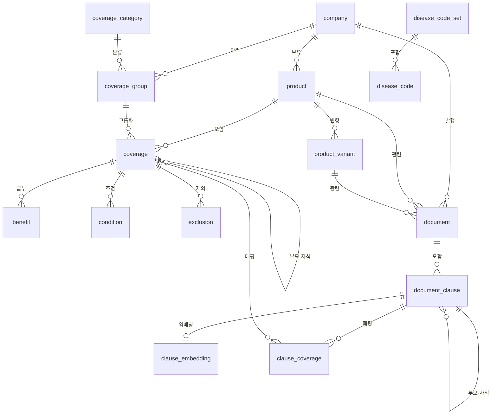
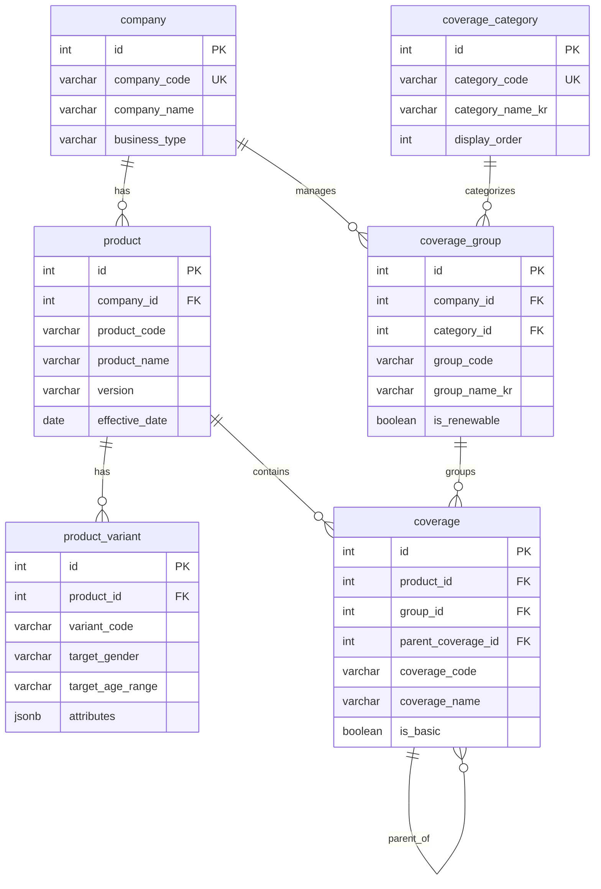
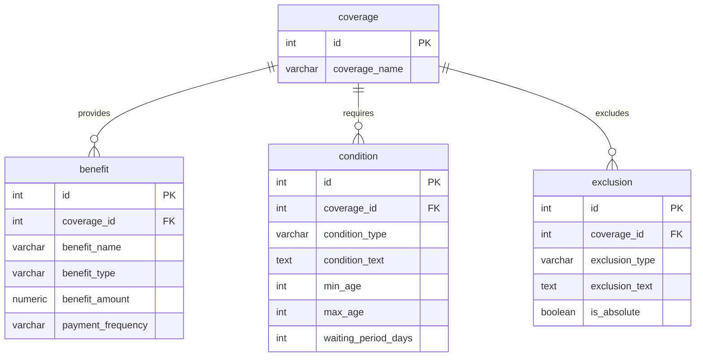
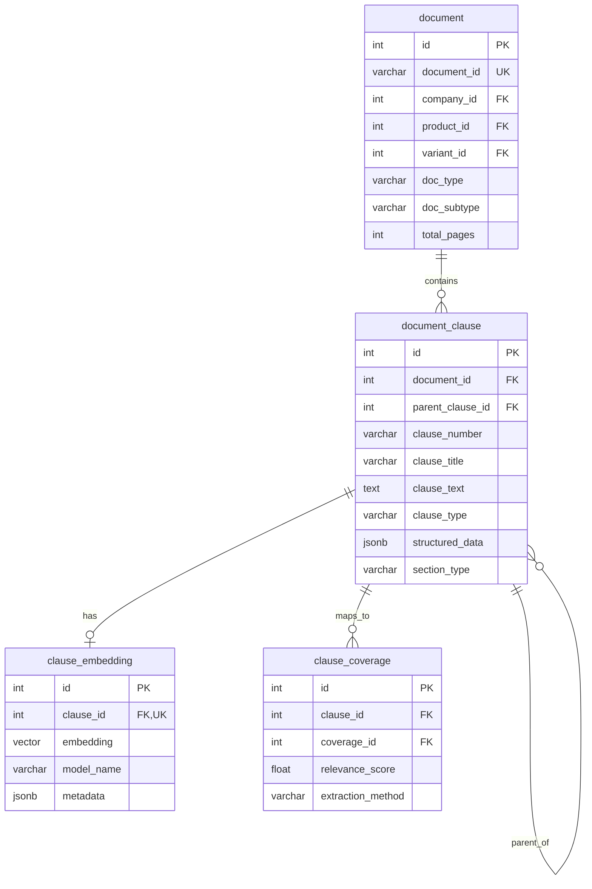
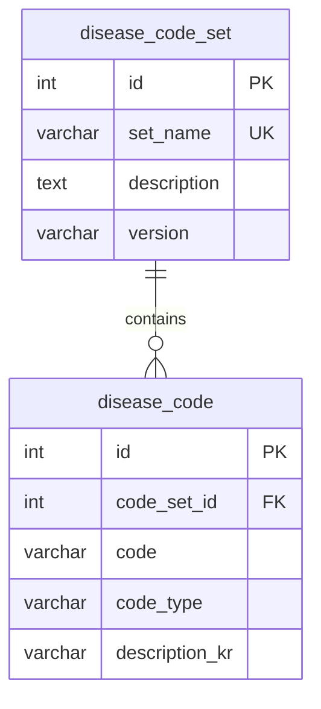

# E-R 다이어그램 (Entity-Relationship Diagram)

> 작성일: 2025-12-13

## 전체 구조 개요

보험 온톨로지 시스템은 크게 **4개 도메인**으로 구성됩니다:

1. **보험사/상품 도메인** - 회사, 상품, 담보 구조
2. **문서 도메인** - 약관, 조항, 임베딩
3. **질병코드 도메인** - KCD/ICD 코드 관리
4. **매핑 도메인** - 조항-담보 연결

---

## 1. 전체 E-R 다이어그램



---

## 2. 도메인별 상세 다이어그램

### 2.1 보험사/상품 도메인



### 2.2 담보 상세 도메인



### 2.3 문서 도메인



### 2.4 질병코드 도메인



---

## 3. 주요 관계 설명

### 3.1 계층 관계 (Self-referencing)

| 테이블 | 관계 | 설명 |
|--------|------|------|
| `coverage` | parent_coverage_id → coverage.id | 담보 계층 (예: 암진단금 → 일반암진단금, 고액암진단금) |
| `document_clause` | parent_clause_id → document_clause.id | 조항 계층 (예: 제1조 → 1항, 2항) |

### 3.2 다대다 관계 (M:N)

| 관계 | 중간 테이블 | 설명 |
|------|-------------|------|
| document_clause ↔ coverage | `clause_coverage` | 조항-담보 매핑 (벡터 검색 필터링용) |

### 3.3 1:1 관계

| From | To | 설명 |
|------|-----|------|
| document_clause | clause_embedding | 각 조항은 하나의 임베딩을 가짐 |

---

## 4. 카디널리티 요약

| 관계 | 카디널리티 | 비고 |
|------|------------|------|
| company → product | 1:N | 한 회사가 여러 상품 |
| product → coverage | 1:N | 한 상품에 여러 담보 |
| product → product_variant | 1:N | 성별/연령별 변형 |
| coverage → benefit | 1:N | 한 담보에 여러 급부 |
| coverage → condition | 1:N | 한 담보에 여러 조건 |
| coverage → exclusion | 1:N | 한 담보에 여러 제외사항 |
| document → document_clause | 1:N | 한 문서에 여러 조항 |
| document_clause → clause_embedding | 1:1 | 조항당 하나의 임베딩 |
| document_clause ↔ coverage | M:N | 조항-담보 매핑 |

---

## 5. 인덱스 전략

### 5.1 기본키/유니크 인덱스
- 모든 테이블에 `id` 기본키
- 비즈니스 키에 유니크 제약 (company_code, document_id 등)

### 5.2 외래키 인덱스
- 모든 FK 컬럼에 B-tree 인덱스

### 5.3 특수 인덱스
- `clause_embedding.embedding`: HNSW 인덱스 (벡터 검색)
- `clause_embedding.metadata`: GIN 인덱스 (JSONB 검색)
- `document_clause.structured_data`: GIN 인덱스 (JSONB 검색)

---

## 6. 구현 파일

이 설계 문서는 다음 파일로 구현됩니다:

| 구현 파일 | 설명 | 상태 |
|-----------|------|------|
| [`../postgres/001_initial_schema.sql`](../postgres/001_initial_schema.sql) | PostgreSQL DDL (테이블, 인덱스, 제약조건) | ✅ 구현됨 |
| [`../postgres/002_seed_data.sql`](../postgres/002_seed_data.sql) | 초기 시드 데이터 (coverage_category 등) | ✅ 구현됨 |

### 설계 → 구현 흐름

```
ER_DIAGRAM.md (이 문서)
    │
    ├── DATA_DICTIONARY.md (컬럼 상세)
    ├── RELATIONSHIP_MAP.md (FK 관계)
    └── DOMAIN_MODEL.md (비즈니스 설명)
            │
            ↓ 구현
    postgres/001_initial_schema.sql
            │
            ↓ 적용
    PostgreSQL 데이터베이스
```

---

## 참고 문서

- [DATA_DICTIONARY.md](./DATA_DICTIONARY.md) - 컬럼별 상세 정의
- [RELATIONSHIP_MAP.md](./RELATIONSHIP_MAP.md) - 외래키 관계 목록
- [DOMAIN_MODEL.md](./DOMAIN_MODEL.md) - 비즈니스 도메인 설명
