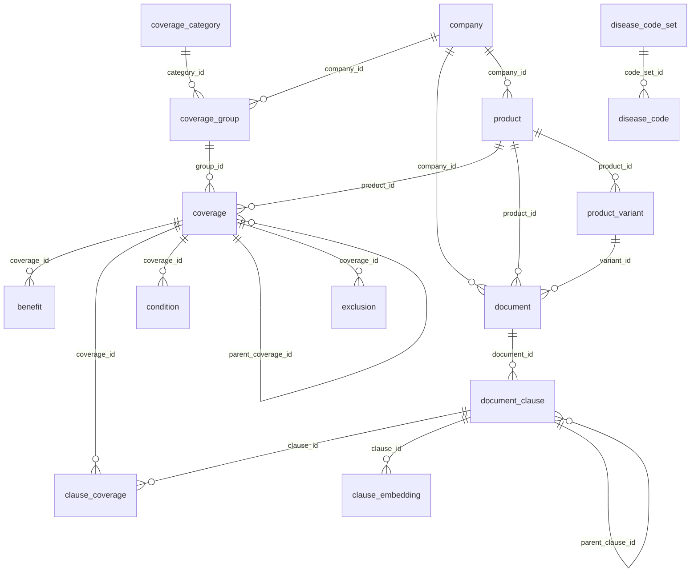

# 테이블 관계 맵 (Relationship Map)

> 자동 생성일: 2025-12-13 12:25

## 외래키 관계 목록

| From 테이블 | From 컬럼 | → | To 테이블 | To 컬럼 |
|-------------|-----------|---|-----------|---------|
| benefit | coverage_id | → | coverage | id |
| clause_coverage | clause_id | → | document_clause | id |
| clause_coverage | coverage_id | → | coverage | id |
| clause_embedding | clause_id | → | document_clause | id |
| condition | coverage_id | → | coverage | id |
| coverage | group_id | → | coverage_group | id |
| coverage | parent_coverage_id | → | coverage | id |
| coverage | product_id | → | product | id |
| coverage_group | category_id | → | coverage_category | id |
| coverage_group | company_id | → | company | id |
| disease_code | code_set_id | → | disease_code_set | id |
| document | company_id | → | company | id |
| document | product_id | → | product | id |
| document | variant_id | → | product_variant | id |
| document_clause | document_id | → | document | id |
| document_clause | parent_clause_id | → | document_clause | id |
| exclusion | coverage_id | → | coverage | id |
| product | company_id | → | company | id |
| product_variant | product_id | → | product | id |

---

## 테이블별 관계 요약

### benefit
_담보별 보장 급부_

**참조하는 테이블:**
- `coverage_id` → `coverage.id`

### clause_coverage
_v2: 조항-담보 M:N 매핑 (필터링된 벡터 검색용)_

**참조하는 테이블:**
- `clause_id` → `document_clause.id`
- `coverage_id` → `coverage.id`

### clause_embedding
_v2: 조항 벡터 임베딩 (FastEmbed BGE-Small 384d)_

**참조하는 테이블:**
- `clause_id` → `document_clause.id`

### company
_보험사 마스터_

**참조되는 테이블:**
- `coverage_group.company_id` → `id`
- `document.company_id` → `id`
- `product.company_id` → `id`

### condition
_담보별 보장 조건_

**참조하는 테이블:**
- `coverage_id` → `coverage.id`

### coverage
_담보 (특별약관 단위)_

**참조하는 테이블:**
- `group_id` → `coverage_group.id`
- `parent_coverage_id` → `coverage.id`
- `product_id` → `product.id`

**참조되는 테이블:**
- `benefit.coverage_id` → `id`
- `clause_coverage.coverage_id` → `id`
- `condition.coverage_id` → `id`
- `coverage.parent_coverage_id` → `id`
- `exclusion.coverage_id` → `id`

### coverage_category
_담보 카테고리 (암진단군, 2대질병진단군 등)_

**참조되는 테이블:**
- `coverage_group.category_id` → `id`

### coverage_group
_특별약관군 (무배당암 진단 보장 특별약관군 등)_

**참조하는 테이블:**
- `category_id` → `coverage_category.id`
- `company_id` → `company.id`

**참조되는 테이블:**
- `coverage.group_id` → `id`

### disease_code
_질병코드 (KCD, ICD)_

**참조하는 테이블:**
- `code_set_id` → `disease_code_set.id`

### disease_code_set
_질병코드 집합 (암, 뇌출혈, 급성심근경색 등)_

**참조되는 테이블:**
- `disease_code.code_set_id` → `id`

### document
_약관, 사업방법서, 상품요약서, 가입설계서 문서_

**참조하는 테이블:**
- `company_id` → `company.id`
- `product_id` → `product.id`
- `variant_id` → `product_variant.id`

**참조되는 테이블:**
- `document_clause.document_id` → `id`

### document_clause
_문서 조항/청크 (제n조 단위 + 테이블 행)_

**참조하는 테이블:**
- `document_id` → `document.id`
- `parent_clause_id` → `document_clause.id`

**참조되는 테이블:**
- `clause_coverage.clause_id` → `id`
- `clause_embedding.clause_id` → `id`
- `document_clause.parent_clause_id` → `id`

### exclusion
_담보별 보장 제외 사항_

**참조하는 테이블:**
- `coverage_id` → `coverage.id`

### product
_보험 상품 마스터_

**참조하는 테이블:**
- `company_id` → `company.id`

**참조되는 테이블:**
- `coverage.product_id` → `id`
- `document.product_id` → `id`
- `product_variant.product_id` → `id`

### product_variant
_상품 변형 (성별/연령 분리, 1형/2형, 1종/3종/4종 등)_

**참조하는 테이블:**
- `product_id` → `product.id`

**참조되는 테이블:**
- `document.variant_id` → `id`

---

## ER 다이어그램 (Mermaid)

